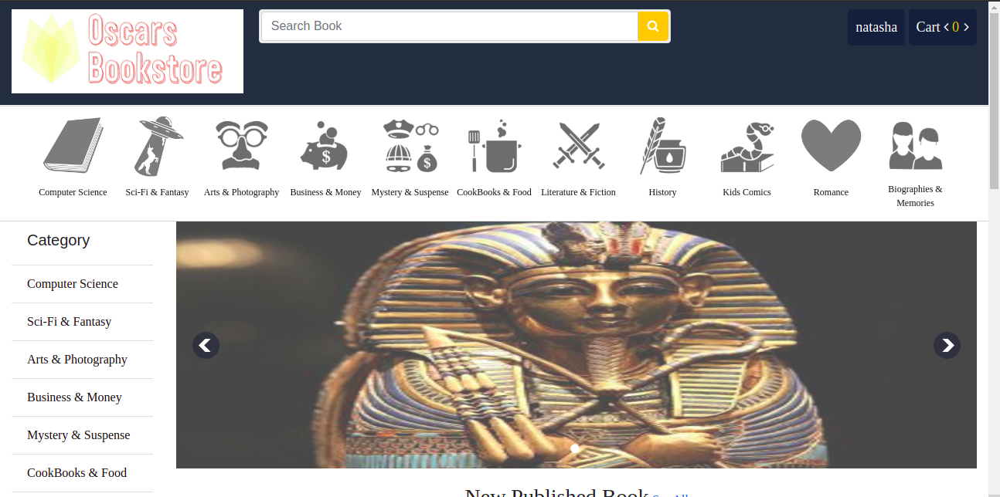

# OSCAR-BOOK-STORE
---


---
## Description  
This is an online book-store where users must sign-up first to be able to purchase a novel, the user can choose from different categories of the choice. When ## checking out the can remove a novel from the cart or continue shopping

---
## User Story
- The application has an in-built feature where the user can sign-out as a guest or as a returning customer. 
- A user can view and search for a novel.
- The cart feature allows the user to add their items into the cart which will calculate the cost of items in the cart.
- A user can decide to take out an item from the cart they will be able to remove their item of choice from the cart.

---

## Setup and Installation  


##### Install and activate Virtual  

- python3 -m venv virtual - source virtual/bin/activate  
```  
##### Install Dependencies  
 ```bash 
 pip install -r requirements.txt 
```  
 ##### Setup Database  
  SetUp your database User,Password, Host then make migrate  
 ```bash 
python manage.py makemigrations 
 ``` 
 Now Migrate  
 ```bash 
 python manage.py migrate 
```
##### Run the application  
 ```bash 
 python manage.py runserver 
``` 
##### Testing the application  
 ```bash 
 python manage.py test 
```
Open the application on your browser `127.0.0.1:8000`.

## Contact Information   
kinuthianatasha@gmail.com 

---

### License
  
* LICENSED UNDER  [](license/MIT)


# Installation 


```
    pip install django-cors-headers
    pip install django-crispy-forms
    pip install xhtml2pdf
```


python3.x manage.py migrate

python3.x manage.py runserver


</br>
